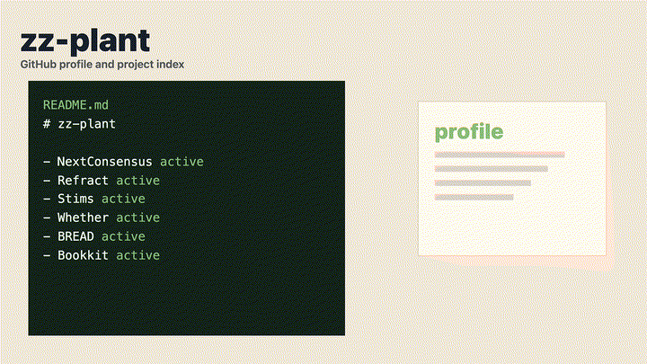

# Kanav Jain

Product leader building decision infrastructure for healthcare, AI, and other high-stakes systems.

  <a href="https://kanav.net">kanav.net</a> ·
  <a href="https://thecrumple.zone">The Crumple Zone</a> ·
  <a href="https://github.com/zz-plant">GitHub</a> ·
  <a href="https://x.com/kanavjain">X</a>

  

---

I work on systems where the hard part is not the interface. It is the operating logic underneath it: who owns the decision, what evidence counts, what happens when the system is wrong, and how teams recover without hiding the failure.

My background runs through healthcare product leadership, founder/CEO work, and systems research. I was the early product lead for Doximity Dialer, later worked on care navigation and healthcare platform strategy, and now spend most of my time on decision infrastructure, public-knowledge observability, and governance systems that leave a usable trail.

## Building Now

| Project | What it is | Status |
| --- | --- | --- |
| [NextConsensus](https://nextconsensus.com) | Source-backed review briefs for contested healthcare claims before coverage, formulary, and market-access decisions lock in. | Commercial proof sprint |
| [Refract](https://github.com/refract-org/refract) | Open-source claim-history infrastructure for public knowledge. It turns MediaWiki revision history into deterministic event streams. | Active OSS |
| [The Crumple Zone](https://thecrumple.zone) | Field writing on systems, burden, governance, neurodivergence, and institutional repair. | Active publication |
| [Ethotechnics Studio](https://ethotechnics.com) | Clinical AI safety evaluation and governance advisory for health plans, healthcare AI companies, and investors. | Active client practice |
| [Whether](https://whether.work) | Macro signal translation into operating posture and decision artifacts for startup leaders. | Concept and technical scoping |

## Selected Repos

| Repo | Scene | What it is |
| --- | --- | --- |
| [refract-org/refract](https://github.com/refract-org/refract) | `pipeline` | Deterministic observation engine — structured change events from Wikipedia revision histories |
| [zz-plant/stims](https://github.com/zz-plant/stims) | `signals` | Browser music visualizer — MilkDrop-inspired, audio-reactive, WebGL |
| [zz-plant/whether](https://github.com/zz-plant/whether) | `signals` | Operating posture from public macro signals — Next.js, Cloudflare |
| [zz-plant/bread](https://github.com/zz-plant/bread) | `archive` | Music collective archive — Astro SSG, Leaflet maps, PWA |
| [zz-plant/bookkit](https://github.com/zz-plant/bookkit) | `book` | Recompilable books as software — Astro monorepo, MCP API, frame validators |
| [zz-plant/blog](https://github.com/zz-plant/blog) | `cards` | Custom publication + newsletter stack — D1 subscriber DB, Worker API, queue dispatch |
| [zz-plant/sabnzbd-mcp](https://github.com/zz-plant/sabnzbd-mcp) | `queue` | MCP server for SABnzbd — stdio, pure Python, zero dependencies |
| [zz-plant/toolchain-visualizer](https://github.com/zz-plant/toolchain-visualizer) | `hex` | 3D constellation map — React + Three.js + Zustand |
| [zz-plant/zz-plant](https://github.com/zz-plant/zz-plant) | `profile` | This profile README — project index and operating thesis |

Each repo has a README GIF (`docs/assets/repo-demo.gif`) and a social sharing image (`docs/assets/repo-og.png`). The scene type, accent color, and metadata are shared across all four web properties (kanav.net, nextconsensus-site, ethotechnics.org, thecrumple.zone) via a shared scene rendering module.

## Visual Identity

Every project follows a scene-based visual identity system. Each repo's metadata — accent color drawn from actual CSS tokens, scene type derived from architecture, labels from `package.json` scripts — drives its README GIF, OG social image, and web preview cards. The same `renderCompactScene()` function renders inline SVG previews across all four web properties.

## What I Care About

- Decision records that are useful after the meeting ends.
- Human-in-the-loop systems with real override and repair paths.
- Public knowledge provenance: what changed, when, where, and with what source trail.
- Regulated healthcare workflows where trust depends on clear ownership, timing, and recourse.
- Interfaces that reduce cognitive load instead of moving hidden work onto users and operators.

## Background

- Early product lead for Doximity Dialer; Doximity has since reported large-scale clinician adoption across its telemedicine tools.
- Founder and former CEO of Andwise (raised funding, medical advisory board of over 50 physicians).
- Director of Product at Transcarent, CancerCompass / CTCA Marketplace; Epic EHR implementation.
- Evaluates clinical AI safety through Ethotechnics Studio (ethotechnics.com).
- Writes about decision infrastructure and AI safety at The Crumple Zone (thecrumple.zone).
- Mentor, Techstars Northwestern Medicine Healthcare Accelerator.

## Contact

- Website: [kanav.net](https://kanav.net)
- Writing: [thecrumple.zone](https://thecrumple.zone)
- GitHub: [github.com/zz-plant](https://github.com/zz-plant)
- X: [@kanavjain](https://x.com/kanavjain)
