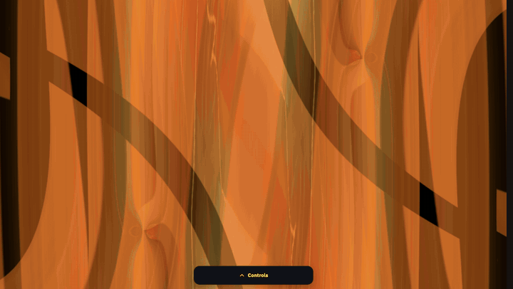
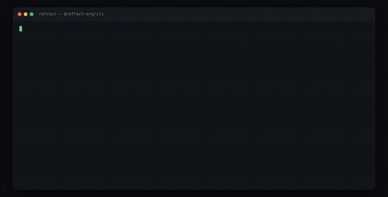
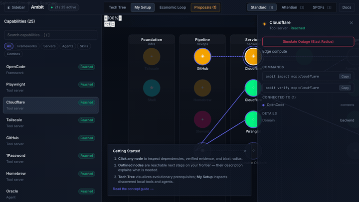
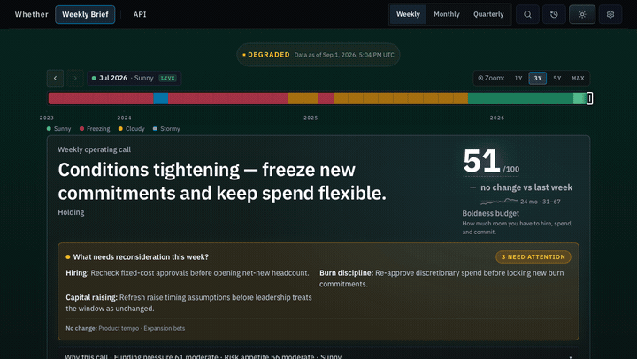
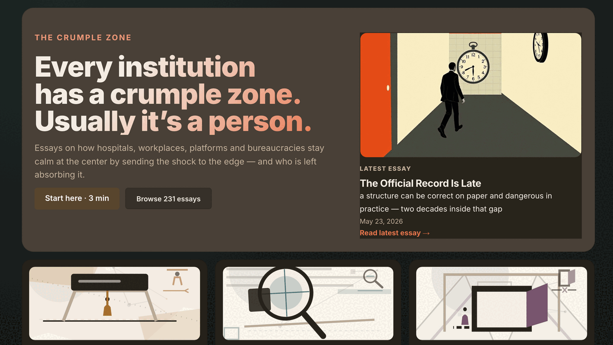
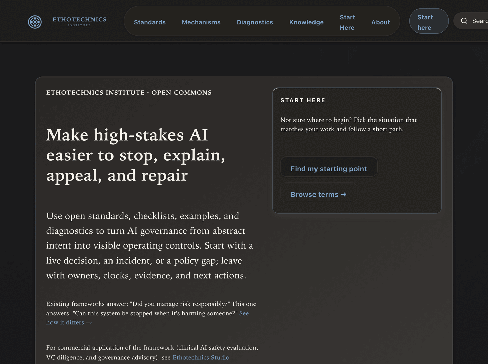

# Kanav Jain

I build healthcare AI products and experimental software around **agent systems, decision infrastructure, and reliable adaptation to changing information**.

  <a href="https://kanav.net">kanav.net</a> ·
  <a href="https://thecrumple.zone">The Crumple Zone</a> ·
  <a href="https://ethotechnics.org">Ethotechnics</a> ·
  <a href="https://x.com/kanavjain">X</a>

  

I'm especially interested in the layer around the model: how software tracks what changed, preserves provenance, knows when assumptions are stale, and identifies repeated human work that should become durable system capability.

A lot of AI capability is limited less by the model than by the surrounding system — missing context, stale state, weak feedback loops, brittle permissions, and humans repeatedly filling gaps by hand. Everything below is a working piece of that surrounding layer.

---

## Stims

**Full-screen visuals that move to whatever you're listening to.** Every scene is a MilkDrop preset — a small visual program — compiled from raw `.milk` source in the browser, with no conversion step and no server.

2,679 presets, a live CodeMirror editor with MilkDrop completions and diagnostics, WebGL2 with guarded WebGPU, and audio from YouTube, mic, a file, or a browser tab. Released into the public domain.

[**Live at toil.fyi**](https://toil.fyi) · [zz-plant/stims](https://github.com/zz-plant/stims) · Unlicense

---

## Refract

**Turns document histories into claim-state timelines.** Given a page, Refract emits a structured event stream of what changed, when, and how — every sentence introduced, modified, or removed; every citation that shifted; every revert and edit cluster.

No model and no inference in the observation path — the same source produces the same events every time. A hash-pinned ground-truth corpus of 16,146 events across ten benchmark pages ships as a release asset. There's a Python SDK, a web explorer, and an MCP server so an agent can query the event stream directly.

[refract-org/refract](https://github.com/refract-org/refract) · [Docs](https://refract-org.github.io/refract-docs/) · AGPL-3.0

---

## Ambit

**Models what an agent system can actually do** across models, tools, machines, permissions, and humans — and where it still gets stuck.

Click a node to inspect its dependencies, verified evidence, and blast radius; simulate an outage to see what stops working. Runs as a meta-MCP server, so agents can query their own capability surface before acting.

[zz-plant/ambit](https://github.com/zz-plant/ambit) · [Interactive demo](https://zz-plant.github.io/ambit/) · MIT

---

## Whether

**Turns macro and capital conditions into a weekly answer for startup leaders:** how aggressively to hire, spend, raise, and expand — with the stop and reopen conditions written down before they're needed.

Deterministic: the same inputs produce the same call. Every posture carries an explicit trip condition and a reopen condition, so a reversal is a rule firing rather than a change of mood.

[**Live at whether.work**](https://whether.work)

---

## The Crumple Zone

**A publication about how institutions distribute their own failures.** Hospitals, workplaces, platforms and bureaucracies stay calm at the center by pushing the shock outward; the essays follow it to whoever ends up absorbing it.

231 essays so far, on a publication and newsletter stack I built and host myself.

[**Live at thecrumple.zone**](https://thecrumple.zone)

---

## Ethotechnics

**A governance commons built around one question most frameworks skip:** can this system be stopped while it's harming someone, by someone other than its owner?

Standards, checklists, worked examples, and diagnostics, organized so you enter with a real situation — a live decision, an incident, a policy gap — and leave with named owners, clocks, and evidence rather than a maturity score.

[**Live at ethotechnics.org**](https://ethotechnics.org) · [zz-plant/ethotechnics.org](https://github.com/zz-plant/ethotechnics.org)

---

## NextConsensus

**Decision briefs for contested healthcare claims.** NextConsensus forecasts specific actions by healthcare institutions from accumulating public evidence — tracking how a claim moves across evidence, labels, payer policy, guidelines, safety signals, and public dispute, then packaging the read as a source-backed review brief.

The goal is not to declare truth. It's to show what changed, why it matters for a pending decision, and where a reviewer still has usable recourse. Refract is the open-source observation engine behind part of this workflow.

[nextconsensus.com](https://nextconsensus.com) · [github.com/nextconsensus](https://github.com/nextconsensus)

---

## Open source

| Repo | What it is | License |
|---|---|---|
| [refract-org/refract](https://github.com/refract-org/refract) | Observation engine: source histories → replayable semantic change events | AGPL-3.0 |
| [refract-org/refract-py](https://github.com/refract-org/refract-py) | Python SDK — query and export provenance event streams as DataFrames | AGPL-3.0 |
| [refract-org/refract-ui](https://github.com/refract-org/refract-ui) | Web explorer for Refract event streams | AGPL-3.0 |
| [refract-org/refract-docs](https://github.com/refract-org/refract-docs) | Schema reference, architecture, CLI, integration guides | AGPL-3.0 |
| [zz-plant/stims](https://github.com/zz-plant/stims) | Browser-native MilkDrop visualizer — 2,679 presets, live `.milk` editor | Unlicense |
| [zz-plant/ambit](https://github.com/zz-plant/ambit) | Capability graph and meta-MCP server for agent environments | MIT |
| [zz-plant/ethotechnics.org](https://github.com/zz-plant/ethotechnics.org) | The Ethotechnics open commons site | — |
| [zz-plant/tenant-tools](https://github.com/zz-plant/tenant-tools) | Building Ledger — privacy-first shared issue tracking for tenant buildings | — |

---

## Healthcare background

U.S. healthcare has spent 15 years moving decisions into software. My work is about making sure responsibility moves with them. I spent 14 years as a product lead across Epic, Doximity, CancerCompass, Transcarent, and Andwise — building products where decisions have to be traceable, challengeable, and reversible.

- **Doximity Dialer** — founding product lead. Patients don't answer calls from unknown numbers — that single observation drove the product. Nine years after I left, Dialer carries 300,000+ calls on an average workday across 250+ hospitals and health systems — #1 Best in KLAS Telehealth Video for five consecutive years.
- **CancerCompass / CTCA Marketplace** — led digital products for an oncology navigation platform serving 30MM annual visitors. Cut bounce rate 25%, lifted chat conversions 267%.
- **Transcarent** — directed care-navigation product across Surgery, Urgent Care, Behavioral Health, and Oncology Care.
- **Epic** — owned what happened to eight client organizations after installation: a 477-bed cancellation risk worked back to a reference account, a 134-year-old health system taken online, and the federal quality-reporting escalation path. The workflow around the clinician was usually the constraint, not the clinician.
- **Andwise** — co-founded a physician financial-wellness company. Raised $240K, grew to 1,200+ physician users and a 700-member community.
- **Georgia Tech** — studied RNA folding dynamics, co-authoring a chapter in the ACS Symposium Series at 19.

## Contact

If you're working on a healthcare AI product that needs to survive real workflow, review, audit, override, and mistakes, I'd like to hear about it.

- [kanav@kanav.net](mailto:kanav@kanav.net)
- [kanav.net](https://kanav.net)
